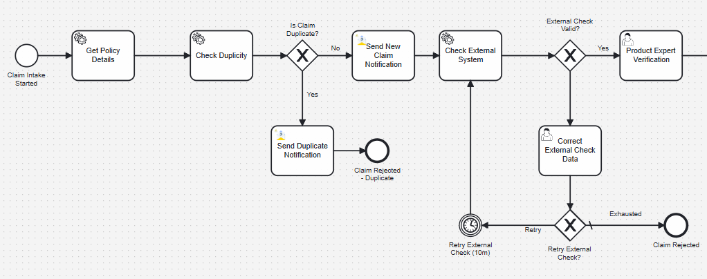
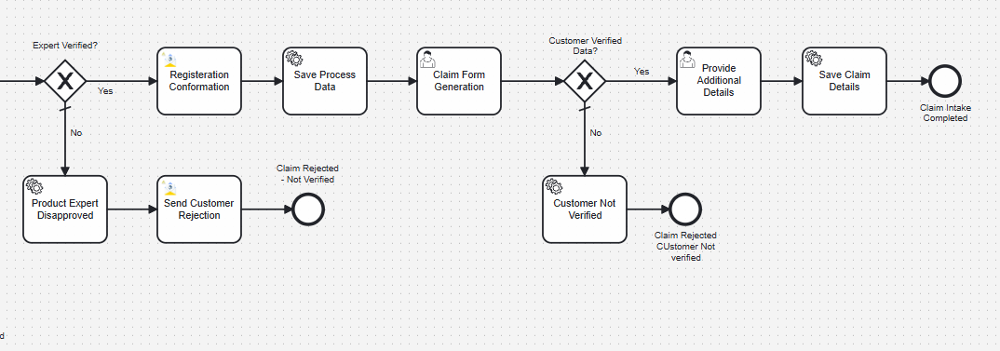
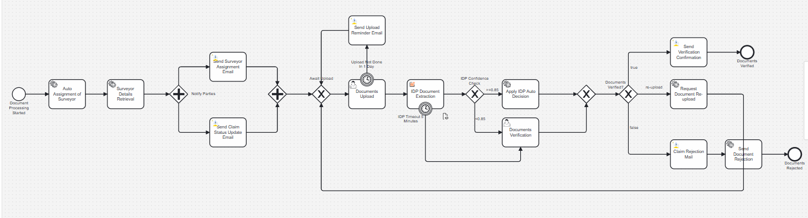
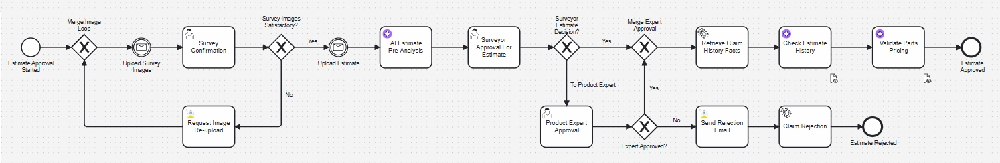
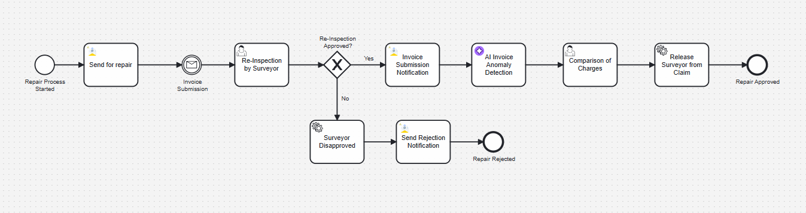
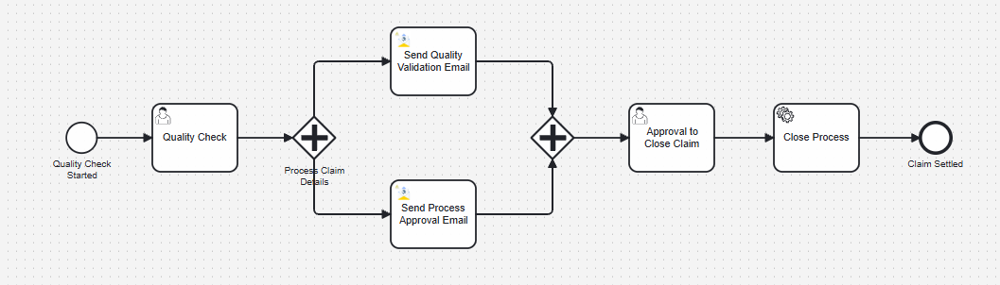

# AI-Orchestrated Motor Insurance Claims Solution

This blueprint showcases an end-to-end motor insurance claims process orchestrated on Camunda 8.  
It is designed to reduce manual rework, improve claim decision quality, and maintain clear auditability from claim submission to settlement closure.

The solution combines stage-wise orchestration, role-based approvals, business rules, and controlled exception paths to keep operations consistent and predictable.

---

## Problem Statement

Traditional motor claim operations are often:
- Slow due to repeated manual checks across teams.
- Inconsistent because approval logic varies by reviewer.
- Fragmented across claim intake, document validation, estimate review, and settlement.
- Risk-prone when retries, rework loops, and rejection handling are not standardized.
- Difficult to audit when decision context is spread across channels.

These issues create avoidable claim delays, higher operational overhead, and lower transparency for claimants and internal teams.

---

## Solution Overview

The Acheron Insurance Claims Solution orchestrates the complete claim lifecycle:

Claim Intake -> Document Processing -> Estimate Approval -> Repair and Inspection -> Quality and Settlement

This approach delivers:
- Faster processing through guided orchestration and automation.
- Better control through explicit human approval checkpoints.
- Cleaner exception handling through bounded retry and re-upload paths.
- Stronger traceability through structured process variables and status transitions.

---

## Workflow Stages

### 1. Claim Intake and Validation
- Captures initial claim details and validates policy and claim consistency.
- Performs duplicate checks and external validation with retry controls.
- Routes to product expert verification for business-level validation.
- Proceeds to next stages only after eligibility and data checks pass.

  

  

---

### 2. Document Processing
- Assigns surveyor and sends notifications.
- Captures required claim documents via upload forms.
- Applies extraction and validation checks with human fallback.
- Supports approval, re-upload request, or rejection with clear routing.

  

---

### 3. Estimate Approval
- Waits for survey image upload and estimate upload via message events.
- Collects customer confirmation for survey image quality.
- Supports surveyor decision and optional product expert escalation.
- Moves approved estimates forward and routes rejected outcomes through defined rejection flow.

  

---

### 4. Repair and Inspection
- Sends repair authorization after estimate approval.
- Handles repair completion updates through event-driven progression.
- Performs invoice and repair consistency checks before completion.
- Releases assigned surveyor after required inspection outcomes are met.

  

---

### 5. Quality and Settlement
- Executes final quality validation before settlement closure.
- Confirms approve/rework direction through explicit decision tasks.
- Finalizes settlement and sends completion communications.
- Closes process with complete traceability of status and decisions.

  

---

## Architecture Components

| Component | Function |
|-----------|----------|
| Camunda 8 | Orchestration engine for BPMN execution, Tasklist, and Operate visibility |
| Spring Boot Workers | Executes service tasks, integrations, and domain validations |
| Camunda Forms | Captures user decisions and claim data at human task stages |
| Email Template Connector | Sends structured notifications to customers and internal roles |
| Persistence Layer | Stores claim, policy, driver, surveyor, and settlement data |

---

## Benefits

| Benefit | Description |
|---------|-------------|
| Faster claim progression | Stage-wise orchestration reduces manual coordination delay |
| Consistent decisions | Rule-driven routing and defined approval gates improve consistency |
| Better exception handling | Re-upload, retry, and rejection paths are explicit and controlled |
| Improved accountability | Role-based tasks separate customer, surveyor, and expert responsibilities |
| Stronger auditability | Status, variables, and decision history are traceable end-to-end |

---

## Camunda 8 Features Utilized

| Feature | Usage |
|---------|-------|
| BPMN 2.0 | End-to-end claim lifecycle orchestration |
| Camunda Forms | Customer, surveyor, and product expert task forms |
| Message Events | Survey images and estimate uploads with correlation |
| Timer and Retry Patterns | Controlled retries and SLA-style waiting behavior |
| Service Tasks | Business integrations, notifications, and validation calls |
| Operate and Tasklist | Monitoring, troubleshooting, and user task execution |

---

## Contact

For support, demos, or implementation help:  
camunda.support@acheron-tech.com
